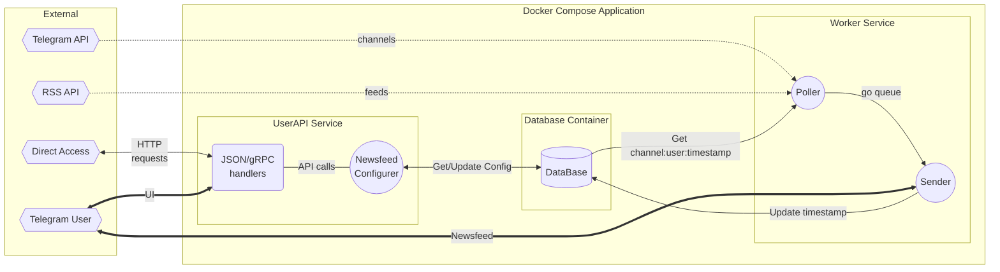

# AggreBot - Newsfeed Aggregator Telegram Bot

```mermaid
flowchart LR

subgraph External
    DIRECT{{Direct Access}}
    TGUSER{{Telegram User}}
    TG{{Telegram API}}
    RSS{{RSS API}}
end
subgraph Docker Compose Application
    subgraph UserAPI [UserAPI Service]
        HANDLERS(JSON/gRPC<br/>handlers)
        CONFIGURER((Newsfeed<br/>Configurer))
    end
    subgraph Database [Database Container]
        DB[(DataBase)]
    end
    subgraph Worker Service
        POLLER((Poller))
        SENDER((Sender))
    end
end

DIRECT <-->|HTTP<br/>requests| HANDLERS
TGUSER <==>|UI| HANDLERS
TG -.->|channels| POLLER
RSS -.->|feeds| POLLER

HANDLERS ---|API calls| CONFIGURER<-->|Get/Update Config| DB

DB -->|Get channel:user:timestamp| POLLER 
POLLER -->|go queue| SENDER
SENDER -->|Update timestamp| DB
TGUSER <==> |Newsfeed| SENDER

```