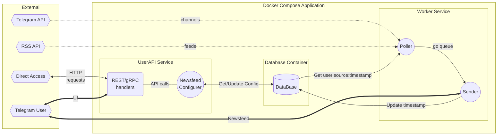

# AggreBot - Newsfeed Aggregator Telegram Bot

## Что это?
**AggreBot** - бот для Telegram, формирующий персональную новостную ленту на
основе различных источников (RSS/Atom фиды, Telegram каналы).

## Как им пользоваться?
### Простой способ
Запустить бот в Telegram и следовать инструкциям.
Через интерфейс можно настроить свою ленту:
- добавить источник с возможным фильтром по ключевому слову (RegExp)
- удалить источник
- проверить статус чтения источников

### Для продвинутых пользователей
С приложением можно общаться через HTTP API - через запросы gRPC или REST 
_(прокси к gRPC)_.

## Как устроен внутри?
### Схема работы приложения

Приложение бота разворачивается через **Docker Compose** на трёх 
контейнерах:
1. UserAPI Service
2. Worker Service
3. Database Container

#### UserAPI Service
Имеет открытый HTTP порт, который принимает запросы через API gRPC/REST и 
работает с базой данных, где хранит конфигурации пользователя (источники).

Доступные методы:
- **addSource** - добавить источник
- **deleteSource** - удалить источник
- **checkStatus** - проверить статус источников

#### Worker Service
Состоит из двух компонентов:
- **Poller** - читает конфигурации пользователь-источник из БД и опрашивает 
  источники. Новые записи отправляет в очередь для Sender.
- **Sender** - рассылает новые записи пользователю (с учётом пользовательского 
  фильтра), обновляя время последней новости в БД.

#### Database Container
PostgreSQL. База данных хранится на host-машине.

---
_Артем **nGragas** Корников. Учебный проект для Ozon Route 256._