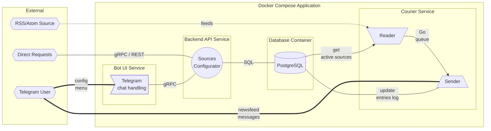

# RSS AggreBot - RSS Aggregator Telegram Bot

## What is it?
**RSS AggreBot** - bot for Telegram, which creates personal newsfeed from different RSS sources.

## How to use?
### Simple way
Start it in Telegram and follow instructions.

Chat interface allows to configure own newsfeed - add/remove sources and configure [RegExp](https://en.wikipedia.org/wiki/Regular_expression) filter.

### For advanced users
It is possible to interact with HTTP API - with gRPC or REST _(proxy to gRPC)_ requests.

## What is inside?
### Application workflow schema

Bot application is deployed with **Docker Compose** from 4 containers:
1. Bot UI Service
2. Backend API Service
3. Courier Service
4. Database Container

#### Bot UI Service
Processes messages/commands from users, making requests to Backend API by gRPC.

#### Backend API Service
Has open HTTP ports that receive requests by gRPC or REST _(proxy to 
gRPC)_.
Works with database, where it stores user configurations (sources).

#### Courier Service
Consists of two components:
- **Reader** - reads all active sources from DB and downloads feed items, that will be passed to Sender for processing.
- **Sender** - sends out new feed items to user (according to user filter) and updates sent info in DB (items hash log).

#### Database Container
PostgreSQL database.

## How to run Bot application?

### Local run
**Prereqs:**
- **Go 1.18+**
- **PostgreSQL 14+**
- [**goose**](https://github.com/pressly/goose)

**Installation:**
1) Set database connection parameters and Bot Token in the file `.env_local`.
2) Run `make goose` to create database tables.

**Start:**
Run in different shells:
1) `make run_backend`
2) `make run_bot_ui`
3) `make run_courier`

### Docker Compose run
**Prereqs:**
- **UNIX**-compatible OS
- **Docker Compose**

Configuration of created Docker Compose application are set by the file `/deploy/.env`.

Shoud be set at least: `TG_TOKEN`.

Set `DB_DATA_HOST_DIR` variable to desired local DB directory.

**Application Control.** Open directory `/deploy/`:
- `make` - build and run
- `make stop` - stop
- `make clean` - delete containers
- `make fclean` - complete remove, including DB files

---
_Artyom **nGragas** Kornikov. Project for Ozon Route 256 Go._

---

# RSS AggreBot - RSS Aggregator Telegram Bot

## Что это?
**RSS AggreBot** - бот для Telegram, формирующий персональную новостную ленту на
основе различных RSS источников.

## Как им пользоваться?
### Простой способ
Запустить бот в Telegram и следовать инструкциям.

Через интерфейс можно настроить свою ленту - добавить/удалить источники и 
настроить [RegExp](https://ru.wikipedia.org/wiki/Регулярные_выражения) фильтр.

### Для продвинутых пользователей
С приложением можно общаться через HTTP API - запросами gRPC или REST 
_(прокси к gRPC)_.

## Как устроен внутри?
### Схема работы приложения

Приложение бота разворачивается через **Docker Compose** на четырёх 
контейнерах:
1. Bot UI Service
2. Backend API Service
3. Courier Service
4. Database Container

#### Bot UI Service
Обрабатывает сообщения/команды пользователей, транслируя запросы к
Backend API через gRPC.

#### Backend API Service
Имеет открытые HTTP порты, принимающие запросы через gRPC или REST _(прокси к 
gRPC)_.
Работает с базой данных, где хранит конфигурации пользователя (источники).

#### Courier Service
Состоит из двух компонентов:
- **Reader** - читает все активные источники из БД и скачивает их записи, 
  которые передаёт для обработки Sender.
- **Sender** - рассылает новые записи пользователю (с учётом пользовательского 
  фильтра), обновляя в БД информацию об отправленных (лог хешей записей).

#### Database Container
База данных PostgreSQL.

## Как запустить самостоятельно?

### Локальный запуск
**Требования:**
- **Go 1.18+**
- **PostgreSQL 14+**
- [**goose**](https://github.com/pressly/goose)

**Установка:**
1) В файле `.env_local` указать параметры подключения к Базе 
Данных и Токен бота.
2) Выполнить `make goose` для создания таблиц БД.

**Запуск**.
Выполнить в отдельных оболочках:
1) `make run_backend`
2) `make run_bot_ui`
3) `make run_courier`

### Запуск в Docker Compose
**Требования:**
- **UNIX**-совместимая ОС
- **Docker Compose**

Параметры создаваемого приложения Docker Compose задаются через файл
`/deploy/.env`.

В нём необходимо как минимум указать Токен бота - `TG_TOKEN`.

Через переменную `DB_DATA_HOST_DIR` можно изменить место хранения БД.

**Управление.** Перейти в директорию `/deploy/`:
- `make` - сборка и запуск
- `make stop` - остановка
- `make clean` - удаление контейнеров
- `make fclean` - полное удаление, включая файлы БД

---
_Артем **nGragas** Корников. Учебный проект для Ozon Route 256._
