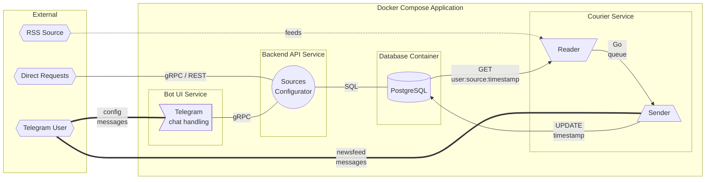

# AggreBot - RSS Aggregator Telegram Bot

## Что это?
**AggreBot** - бот для Telegram, формирующий персональную новостную ленту на
основе различных RSS источников.

## Как им пользоваться?
### Простой способ
Запустить бот в Telegram и следовать инструкциям.

Через интерфейс можно настроить свою ленту - добавить/удалить источники и 
настроить [RegExp](https://ru.wikipedia.org/wiki/Регулярные_выражения) фильтр.

### Для продвинутых пользователей
С приложением можно общаться через HTTP API - запросами gRPC или REST 
_(прокси к gRPC)_.

## Как устроен внутри?
### Схема работы приложения

Приложение бота разворачивается через **Docker Compose** на четырёх 
контейнерах:
1. Bot UI Service
2. Backend API Service
3. Courier Service
4. Database Container

#### Bot UI Service
Обрабатывает сообщения/команды пользователей, транслируя запросы к
Backend API через gRPC.

#### Backend API Service
Имеет открытые HTTP порты, принимающие запросы через gRPC или REST _(прокси к 
gRPC)_.
Работает с базой данных, где хранит конфигурации пользователя (источники).

#### Courier Service
Состоит из двух компонентов:
- **Reader** - читает пользовательские конфигурации из БД и обходит 
  RSS источники. Новые записи передаёт для обработки к Sender.
- **Sender** - рассылает новые записи пользователю (с учётом пользовательского 
  фильтра), обновляя время последней записи в БД.

#### Database Container
База данных PostgreSQL. Хранится на host-машине.

---
_Артем **nGragas** Корников. Учебный проект для Ozon Route 256._